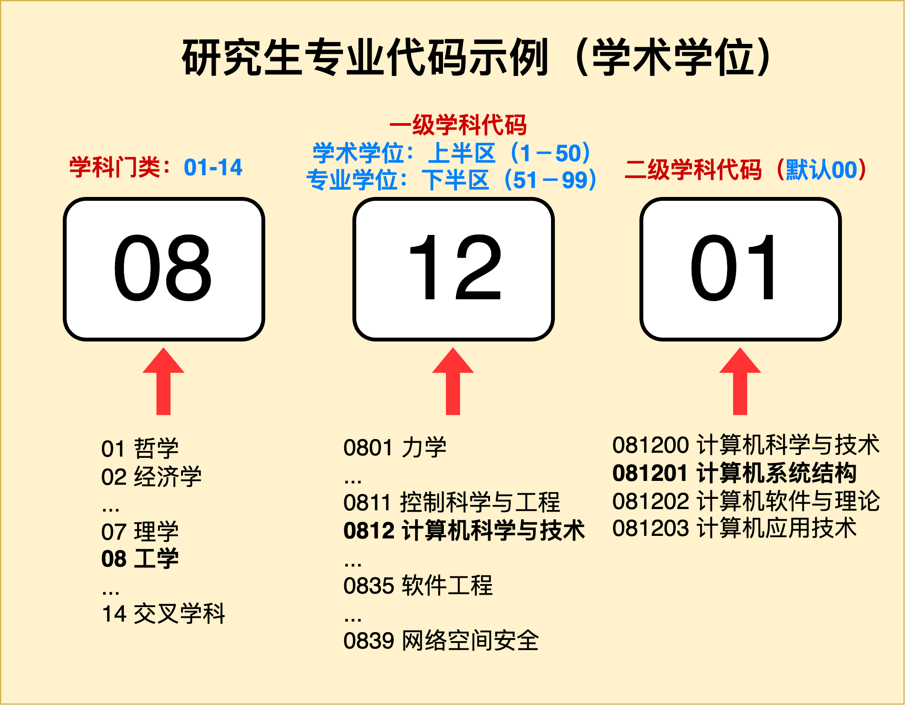
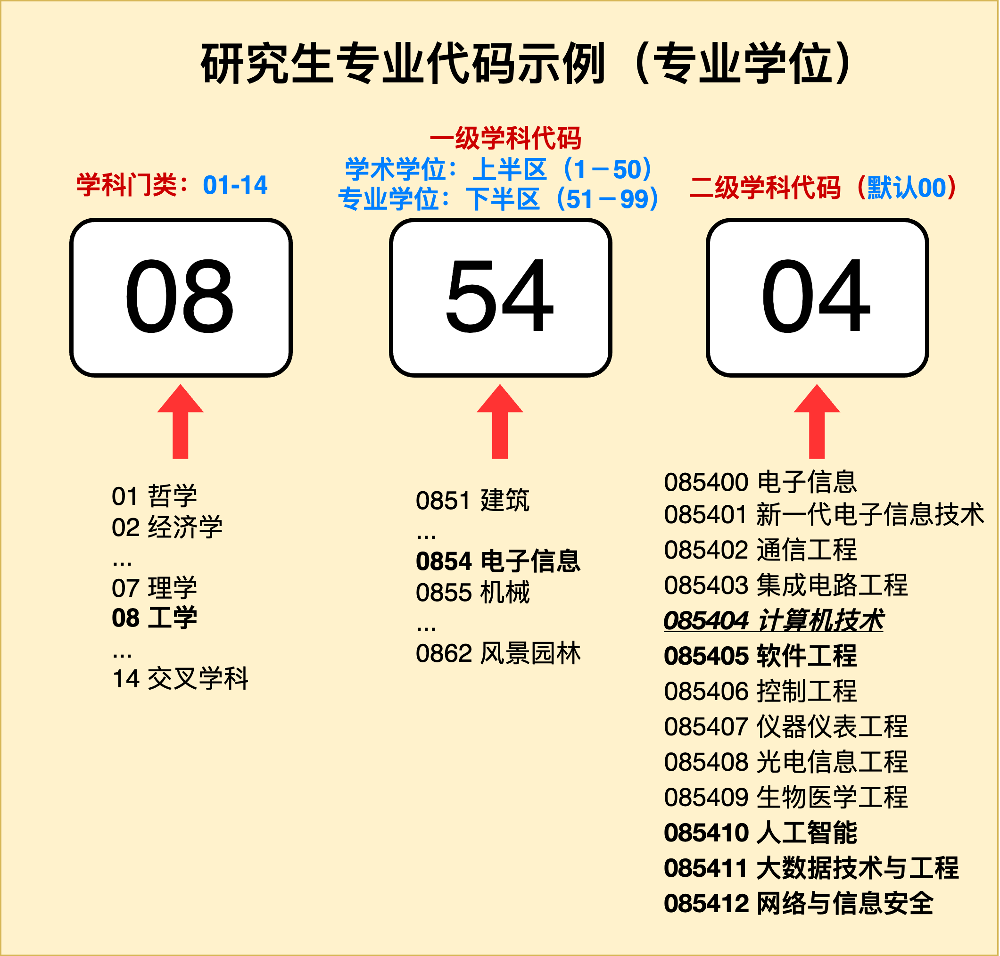
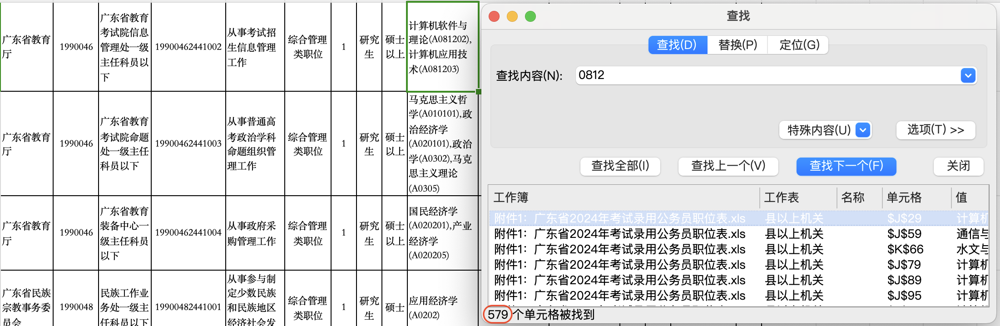
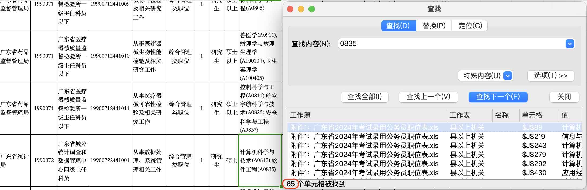

# (Special Issue)专业代码那些事儿

## 1. 专业代码是什么？
专业代码是教育部用于标识和管理不同学科专业的一种编码，通常由6位数字组成。专业代码在`本科专业设置`和`研究生专业设置`上是分离的。需要注意的的一点是⚠️：***两者并不相关，需要分情况说明，不可以混为一谈。***

### 1.1 研究生教育学科专业目录（研究生专业代码）
目前研究生教育学科专业目录最新版本为2022版，并从2023年起开始实施。可通过研招网下载附件📎查看：[研究生教育学科专业目录（2022年）](https://yz.chsi.com.cn/kyzx/jybzc/202209/20220914/2216547448.html)  

其中“研究生教育学科专业目录”中对于**专业学位**代码非常模糊，具体的**专业学位**代码请查看：[关于电子信息等8种专业学位类别专业领域指导性目录的说明](https://meng.tsinghua.edu.cn/docs/20210115210416891658.pdf)  

通过两份文件，我们可以总结出与计算机学科相关的专业代码，如下表：

<b>计算机学科相关专业研究生代码汇总</b>

| 学位类型 | 专业代码 | 专业名称           |
| ------  | ------ | ----------------  |
| 学术学位 | 081200   | 计算机科学与技术   |
| 学术学位 | 083500   | 软件工程          |
| 学术学位 | 083900   | 网络空间安全       |
| 学术学位 | 140500   | 智能科学与技术     |
| 专业学位 | 085400   | 电子信息          |
| 专业学位 | 085404   | 计算机技术        |
| 专业学位 | 085405   | 软件工程          |
| 专业学位 | 085411   | 大数据技术与工程   |
| 专业学位 | 085412   | 网络与信息安全     |

其中，有几点需要强调：
1. 专业代码中，第三、四位被划分成了上下两个半区，上半区为**01-50**，下半区为**51-99**。上半区对应**学术学位**，下半区对应**专业学位**。
2. 专业代码中，第五、六位对应二级学科，对于**专业学位**而言，需要**特别注意**，因为 **0854(电子信息)** 里同时包含计算机、自动化、电子、信息、生医、仪器等方向的专硕，无法表明到底是哪个学科的专硕。

#### 下面是两个计算机类研究生专业代码的示例：

<b>学术学位专业代码示例</b>

<b>专业学位专业代码示例</b>

### 1.2 普通高等学校本科专业目录（本科专业代码）
普通高等学校本科专业目录最新版本为2024版，可通过教育部官方网站下载附件📎查看：[普通高等学校本科专业目录（2024年）](https://www.moe.gov.cn/srcsite/A08/moe_1034/s4930/202403/W020240319305498791768.pdf)

其中，与计算机类有关的专业代码如下表：

# 计算机类相关专业代码汇总

<b>计算机学科相关本科专业代码汇总</b>

| 序号 | 门类、专业类 | 专业代码 | 专业名称           | 学位授予门类   | 修业年限 | 增设年度 |
| ---- | ------------ | -------- | ------------------ | -------------- | -------- | -------- |
| 397  | 计算机类     | 080901   | 计算机科学与技术   | 理学、工学     | 四年     |          |
| 398  | 计算机类     | 080902   | 软件工程           | 工学           | 四年     |          |
| 399  | 计算机类     | 080903   | 网络工程           | 工学           | 四年     |          |
| 400  | 计算机类     | 080904K  | 信息安全           | 管理学、理学、工学 | 四年     |          |
| 401  | 计算机类     | 080905   | 物联网工程         | 工学           | 四年     |          |
| 402  | 计算机类     | 080906   | 数字媒体技术       | 工学           | 四年     |          |
| 403  | 计算机类     | 080907T  | 智能科学与技术     | 理学、工学     | 四年     |          |
| 404  | 计算机类     | 080908T  | 空间信息与数字技术 | 工学           | 四年     |          |
| 405  | 计算机类     | 080909T  | 电子与计算机工程   | 工学           | 四年     |          |
| 406  | 计算机类     | 080910T  | 数据科学与大数据技术 | 理学、工学     | 四年     | 2015     |
| 407  | 计算机类     | 080911TK | 网络空间安全       | 工学           | 四年     | 2015     |
| 408  | 计算机类     | 080912T  | 新媒体技术         | 工学           | 四年     | 2016     |
| 409  | 计算机类     | 080913T  | 电影制作           | 工学           | 四年     | 2016     |
| 410  | 计算机类     | 080914TK | 保密技术           | 工学           | 四年     | 2017     |
| 411  | 计算机类     | 080915T  | 服务科学与工程     | 工学           | 四年     | 2019     |
| 412  | 计算机类     | 080916T  | 虚拟现实技术       | 工学           | 四年     | 2019     |
| 413  | 计算机类     | 080917T  | 区块链工程         | 工学           | 四年     | 2019     |
| 414  | 计算机类     | 080918TK | 密码科学与技术     | 工学           | 四年     | 2020     |

## 2. 为什么需要专业代码？

害，还不是有单位会看要求，不然谁会来看这些东西？专业代码会在**考公**、**国企招聘**等位置不经意的出现。当然，对于打算进入私企就业的同学来说，专业代码就不是那么重要了。

举个例子🌰，以“[广东省2024年考试录用公务员](https://hrss.gd.gov.cn/zwgk/gsgg/content/post_4332302.html)”为例，0812相比0835在可报考岗位上有着绝对的优势（1405的同学😭）：

<b>0812可报考岗位</b>

<b>0835可报考岗位</b>

## 3. 常见问题

### 3.1 专硕的专业代码是否可以更改？比如从085400（电子信息）更加细化？
&emsp;&emsp;这个问题通常取决于学校，要符合学校的一些要求，比如只能细化到特定的一两个代码之中。ZJU SE就曾发过这样的公告，供大家参考：[软件学院专业学位领域代码调整通知](http://www.cst.zju.edu.cn/2022/1020/c36256a2649375/page.htm)

### 3.2 0812XY例如（0812Z1）这类专业代码是0812吗？
&emsp;&emsp;以0812Z1为例，这类专业代码一般来说是可以算作0812的，也就是一级学科是“计算机科学与技术——学术学位”，所以大多数情况下依然是0812。

### 3.3 以后有考公的打算，该怎么在计算机类学专硕的各个专业中选择？
&emsp;&emsp;答案很明确，0812就是神。所以能够拿到计科学硕对于考公是最有利的，0812也的确是认可度最高的万金油专业（卷成这样不是没有道理的）。而对于最近很多学校把AI学硕挪到140500这样的迷惑操作，实在是对于考公过于不友好了，需要谨慎考虑一下。至于其他的专业包括0835（软件学硕）、0839（网安学硕）、085404/5（计/软专硕），最好还是亲自调研一下目标省份的岗位要求。